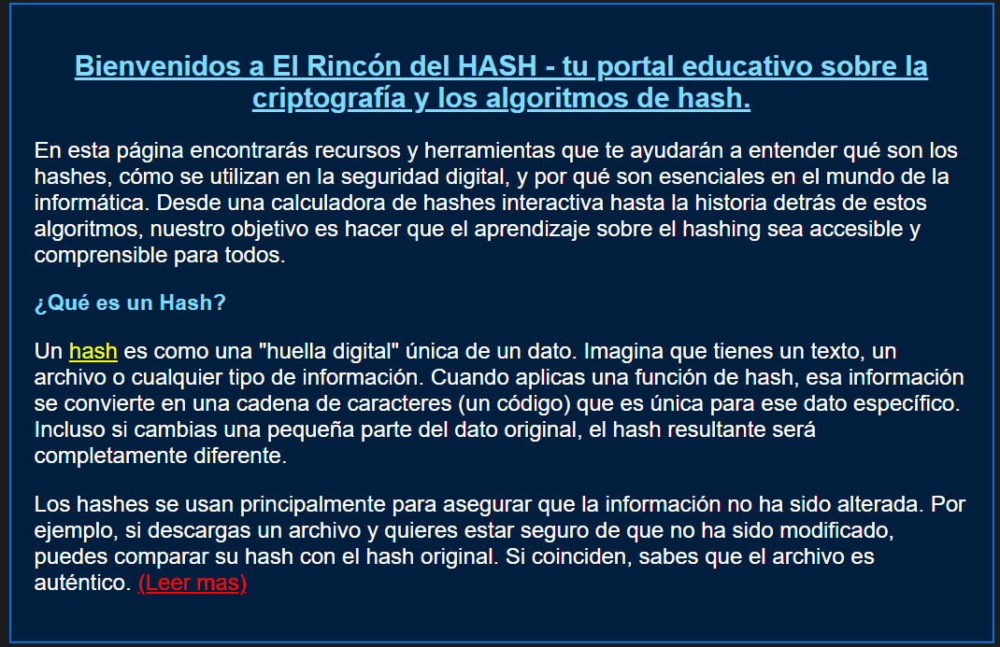
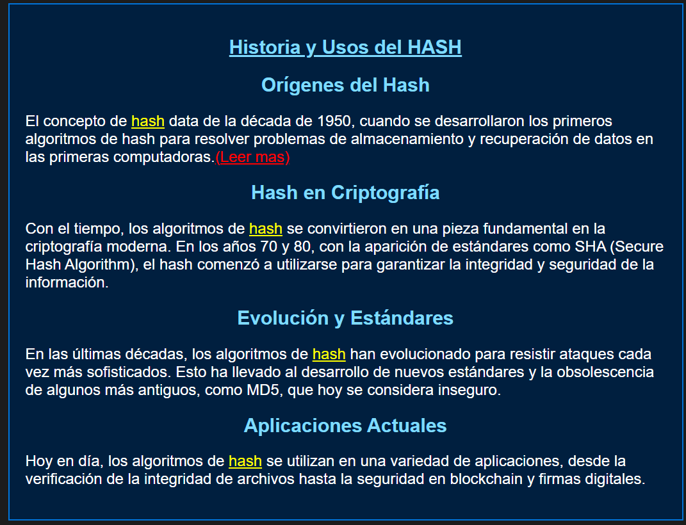
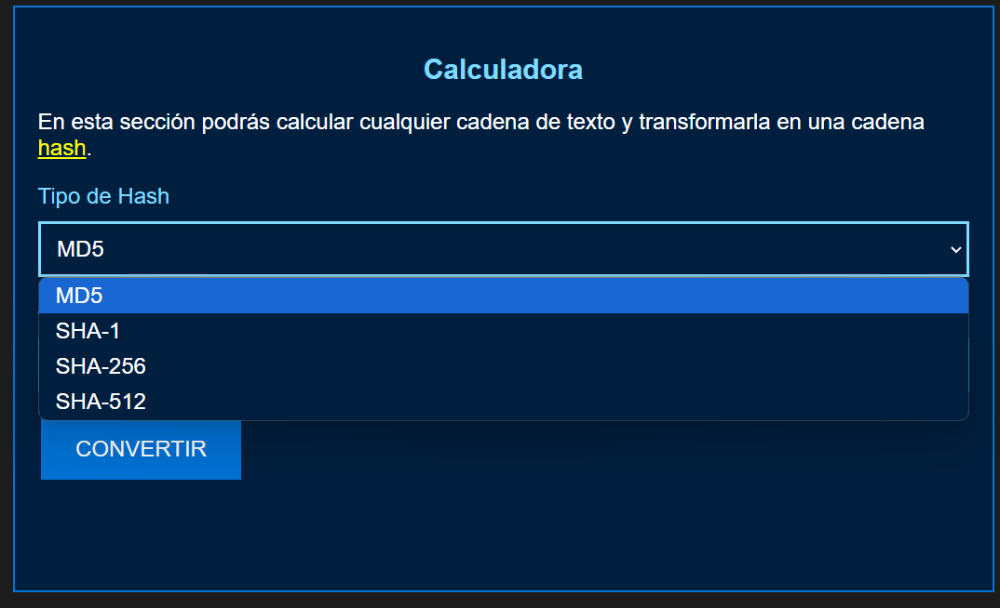

# El Rincón del Hash

**El Rincón del Hash** es una aplicación web educativa diseñada para que los estudiantes y curiosos aprendan cómo funcionan las funciones hash. Estas funciones convierten texto, archivos o imágenes en un código único llamado **hash**, usado en seguridad informática y criptografía.

## ¿Qué hace esta aplicación?

1. **Genera hashes**:
   - Convierte texto o archivos en hashes usando estos algoritmos:
     - MD5
     - SHA-1
     - SHA-256
     - SHA-512
2. **Explica los resultados**:
   - Muestra cómo se generan los hashes y para qué se utilizan.
3. **Guarda los datos**:
   - Los resultados se guardan en un archivo CSV para que los puedas revisar más tarde.

## ¿Quién puede usarla?

Esta herramienta es ideal para:
- Estudiantes que quieren aprender sobre seguridad informática.
- Profesores que desean enseñar cómo funcionan las funciones hash.
- Cualquier persona interesada en el tema.

## Tecnologías utilizadas

El proyecto utiliza estas tecnologías:

- **Frontend** (interfaz):
  - **HTML y CSS**: Para el diseño de la página.
  - **JavaScript** (CryptoJS): Para generar los hashes.

- **Backend** (servidor):
  - **Python** y **Flask**: Para manejar las operaciones y la lógica.

- **Almacenamiento**:
  - **CSV**: Para guardar los hashes generados junto con sus detalles.

## ¿Cómo instalar la aplicación?

### Requisitos

- Tener **Python 3.x** instalado.

